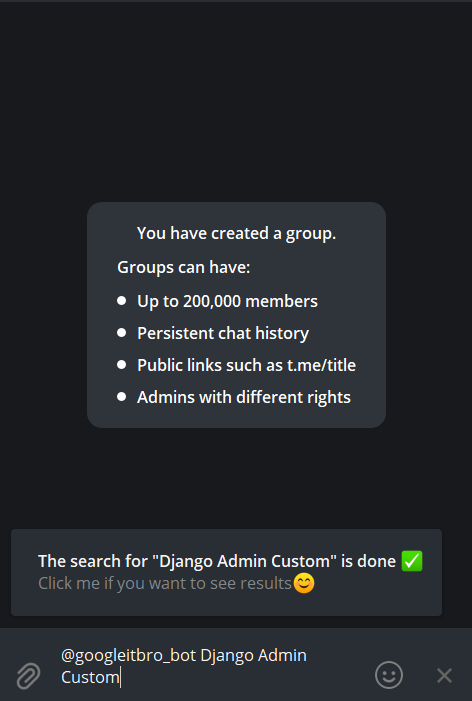
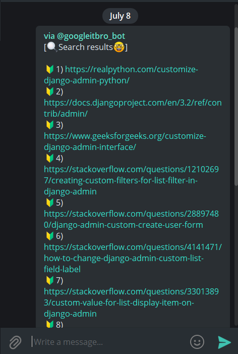

# Just Google-it Telegram Bot !

## **Setup**

Clone this repo:

```bash
$ git clone https://github.com/AbduazizZiyodov/google-it.git
$ cd google-it/
```

Activate virtual enviroment:

```bash
$ python -m venv env
$ source env/bin/activate
```

Install all requirements from file:

```
$ pip install -r requirements.txt
```

On `.env`(dotenv file) write your own keys:

```bash
# Telegram bot token

TELEGRAM_API_TOKEN = ""

# Search Engine Keys
GOOGLE_API_KEY = ""
CSE_ID = ""
```

## **Running**

```bash
$ python bot.py
```

Bot Usage:

After username of your bot, write some search term:


If search is done , you can see inline message from bot. Then you should click it and search results will be sent in your chat.



Abduaziz Ziyodov🎯
